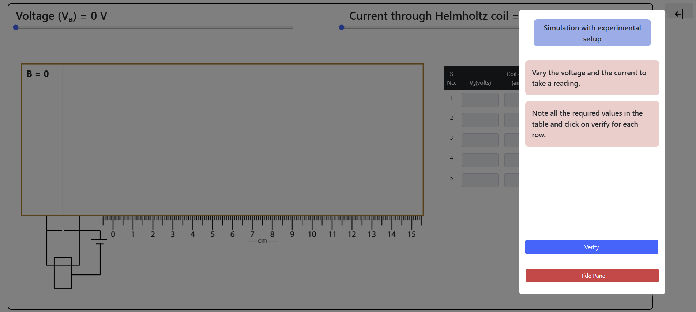
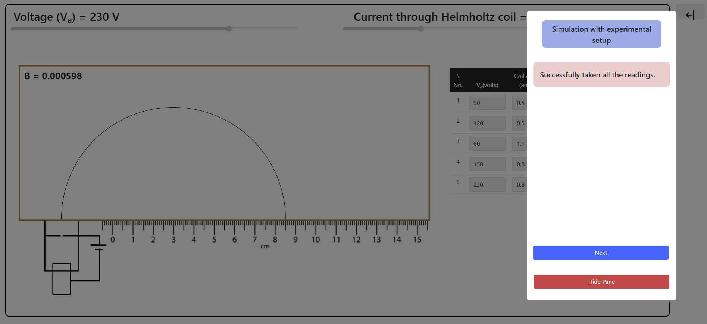
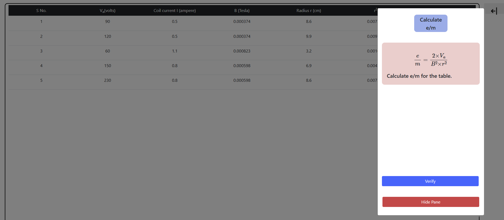
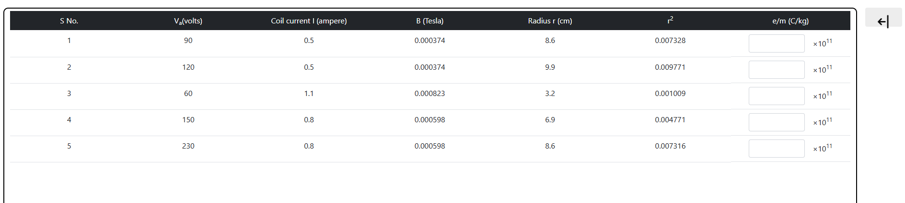
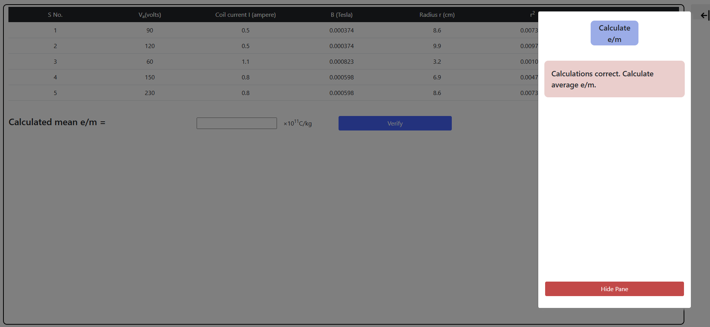
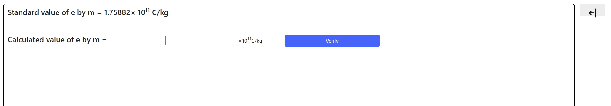
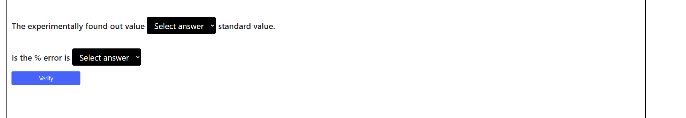

<h2>Procedure:</h2>

<h3>STEP 1:</h3>

Follow the instructions and take the readings.

<h3>STEP 2:</h3>

Calculate e/m for the table.

<h3>STEP 3:</h3>

Calculate mean e/m

<h3>STEP 4:</h3>

Compare standard and calculated value of e/m

