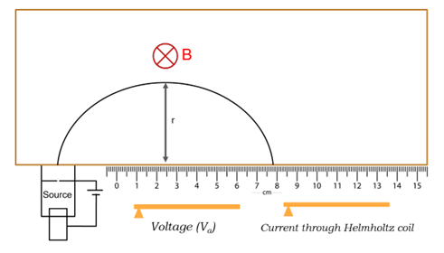

<h2>Theory:</h2>
   

   The charge-to-mass ratio of an electron is a fundamental property in physics, which helps in understanding the behavior of electrons in electric and magnetic fields. When a charged particle, like an electron, moves in the presence of a uniform magnetic field, it experiences a Lorentz force, causing it to travel in a circular path. The centripetal force required for circular motion is provided by the magnetic force. The charge-to-mass ratio can be calculated by knowing the magnetic field, the accelerating voltage, and the radius of the circular path traced by the electron. The importance of this experiment lies in its ability to provide insight into the intrinsic properties of the electron, which was a major discovery in atomic physics. Precise measurement of the charge-to-mass ratio was crucial in confirming the electron as a fundamental particle and helped develop our understanding of electron dynamics in electromagnetic fields. Furthermore, this experiment is important for demonstrating the interaction between electric charges and magnetic fields and visualizing concepts like magnetic forces and centripetal acceleration. In the experimental setup, a Helmholtz coil generates the magnetic field, and the apparatus also includes an electron gun and a voltage supply. The electrons travel in a circular path inside a vacuum tube, where the magnetic field is varied by changing the current in the Helmholtz coils. The radius of the electron’s circular path is measured, and multiple trials are conducted by varying the accelerating voltage and magnetic field to determine the charge-to-mass ratio. The results of this experiment help students grasp the fundamental principles of classical electromagnetism.

<h3>Experimental Design: </h3>

<h3>Formula:</h3>

$$
   \frac{e}{m} = \frac{2V_a}{B^2r^2}
$$

   where,  
   &emsp; e - electron charge  
   &emsp; m - electron mass  
   &emsp; Va - accelerating voltage  
   &emsp; B - magnetic field strength  
   &emsp; r - radius of electron path  

